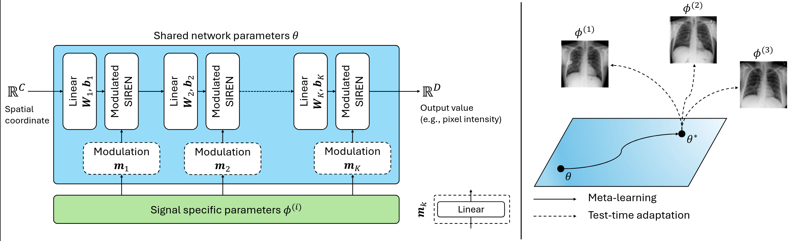

# MedFuncta: Modality Agnostic Representations Based on Efficient Neural Fields
[](https://opensource.org/licenses/MIT)
[](https://pfriedri.github.io/medfuncta-io/)
[](https://arxiv.org/abs/2502.14401)

This is the official PyTorch implementation of the paper **MedFuncta: Modality Agnostic Representations Based on Efficient Neural Fields** by [Paul Friedrich](https://pfriedri.github.io/), [Florentin Bieder](https://dbe.unibas.ch/en/persons/florentin-bieder/) and [Philippe C. Cattin](https://dbe.unibas.ch/en/persons/philippe-claude-cattin/).

If you find our work useful, please consider to :star: **star this repository** and :memo: **cite our paper**:
```bibtex
@article{friedrich2025medfuncta,
         title={MedFuncta: Modality Agnostic Representations Based on Efficient Neural Fields},
         author={Friedrich, Paul and Bieder, Florentin and Cattin, Philippe C},
         journal={arXiv preprint arXiv:2502.14401},
         year={2025}}
```
## Paper Abstract
Recent research in medical image analysis with deep learning has almost exclusively focused on grid- or voxel-based data representations in combination with convolutional neural networks. 
We challenge this common choice by introducing MedFuncta, a modality-agnostic continuous data representation based on neural fields. 
We demonstrate how to obtain these neural fields in a reasonable amount of time and compute, by exploiting redundancy in medical signals and by applying an efficient meta-learning approach with a context reduction scheme. 
We further address the spectral bias in commonly used SIREN activations, by introducing a $\omega_0$-schedule, improving reconstruction quality and convergence speed. 
We validate our proposed approach on a large variety of medical signals of different dimensions and modalities (1D: ECG; 2D: Chest X-Ray, Retinal OCT, Fundus Camera, Dermatoscope, Colon Histopathology, and Cell Microscopy; 3D: Brain MRI, Lung CT) and successfully prove that we can solve relevant downstream tasks on this representation. 
We additionally release a large-scale dataset of > 550 k annotated functional data representations to promote research in this direction.

<p>
    
</p>

## Dependencies
We recommend using a [conda](https://github.com/conda-forge/miniforge#mambaforge) environment to install the required dependencies.
You can create and activate such an environment called `medfuncta` by running the following commands:
```sh
mamba env create -f environment.yaml
mamba activate medfuncta
```
## Training (Meta-Learning)
To obtain meta-learned shared model parameters, simply run the following command with the correct `config.yaml`:
```sh
CUDA_VISIBLE_DEVICES=0 python train.py --config ./configs/experiments/DATATYPE/DATASET_RESOLUTION.yaml
```

## Evaluation (Test-Time Adaptation/ Reconstruction Experiments)
To perform reconstruction experiments (evaluate the representation quality), simply run the following command with the correct `config.yaml`:
```sh
CUDA_VISIBLE_DEVICES=0 python eval.py --config ./configs/eval/DATATYPE/DATASET_RESOLUTION.yaml
```
## Create a MedFuncta set
To convert a dataset into our MedFuncta representation, simply run the following command with the correct `config.yaml`:
```sh
CUDA_VISIBLE_DEVICES=0 python fit_NFset.py --config ./configs/fit/DATATYPE/DATASET_RESOLUTION.yaml
```


## Data
To ensure good reproducibility, we trained and evaluated our network on publicly available datasets:
* **MedMNIST**, a large-scale MNIST-like collection of standardized biomedical images. More information is avilable [here](https://medmnist.com/).

* **MIT-BIH Arryhythmia**, a heartbeat classification dataset. We use a preprocessed version that is available [here](https://www.kaggle.com/datasets/shayanfazeli/heartbeat).

* **BRATS 2023: Adult Glioma**, a dataset containing routine clinically-acquired, multi-site multiparametric magnetic resonance imaging (MRI) scans of brain tumor patients. We just used the T1-weighted images for training. The data is available [here](https://www.synapse.org/#!Synapse:syn51514105).

* **LIDC-IDRI**, a dataset containing multi-site, thoracic computed tomography (CT) scans of lung cancer patients. The data is available [here](https://wiki.cancerimagingarchive.net/pages/viewpage.action?pageId=1966254).

The provided code works for the following data structure (you might need to adapt the directories in `data/dataset.py`):
```
data
└───BRATS
    └───BraTS-GLI-00000-000
        └───BraTS-GLI-00000-000-seg.nii.gz
        └───BraTS-GLI-00000-000-t1c.nii.gz
        └───BraTS-GLI-00000-000-t1n.nii.gz
        └───BraTS-GLI-00000-000-t2f.nii.gz
        └───BraTS-GLI-00000-000-t2w.nii.gz  
    └───BraTS-GLI-00001-000
    └───BraTS-GLI-00002-000
    ...

└───LIDC-IDRI
    └───LIDC-IDRI-0001
      └───preprocessed.nii.gz
    └───LIDC-IDRI-0002
    └───LIDC-IDRI-0003
    ...
    
└───MIT-BIH
    └───mitbih_test.csv
    └───mitbih_train.csv
    
    ...
```
We provide a script for preprocessing LIDC-IDRI. Simply run the following command with the correct path to the downloaded DICOM files `DICOM_PATH` and the directory you want to store the processed nifti files `NIFTI_PATH`:
```sh
python data/preproc_lidc-idri.py --dicom_dir DICOM_PATH --nifti_dir NIFTI_PATH
```

## Acknowledgements
Our code is based on / inspired by the following repositories:
* https://github.com/jihoontack/GradNCP 
* https://github.com/google-deepmind/functa
* https://github.com/pfriedri/wdm-3d